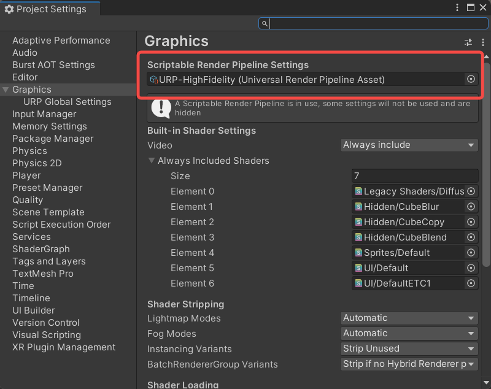
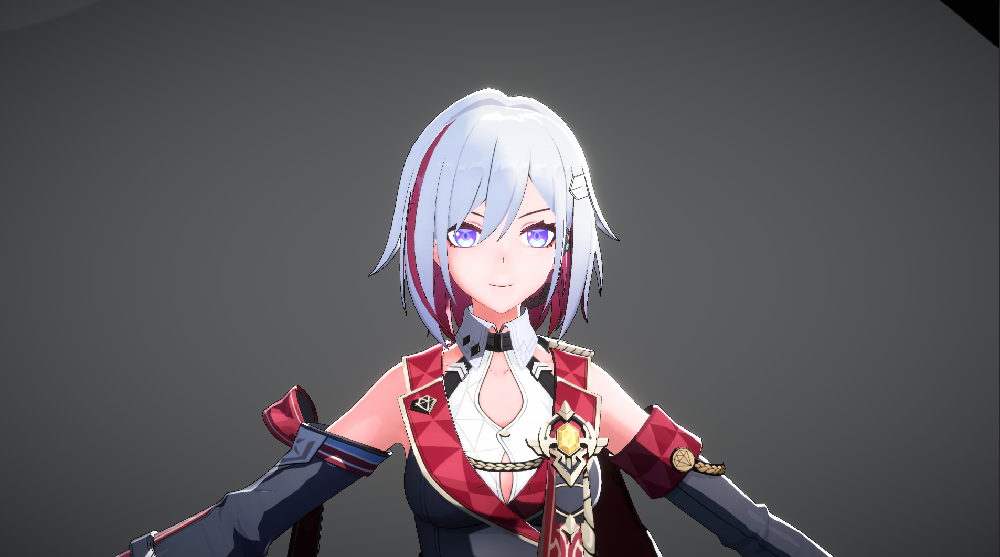
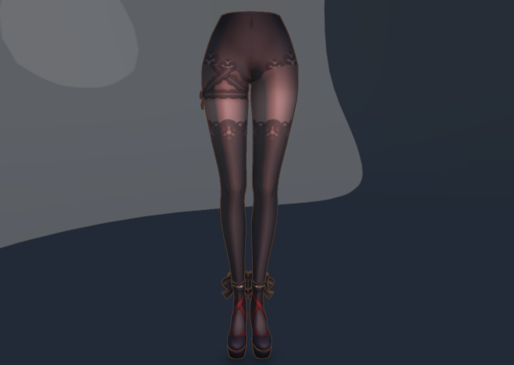

# ToonURP

## Unity版本

 - Unity 2022.3
 - URP14

## 安装使用

0. 使用Unity 2022.3创建一个build-in的项目（因为之后要自行添加URP包）

1. 进入Unity项目的Packages文件夹
2. 运行（这一步是clone一个我略微修改的URP package）

```cpp
git clone -b toon-urp https://github.com/Reuben-Sun/URP-Package.git
```

3. 运行（clone ToonURP）

```
git clone https://github.com/Reuben-Sun/ToonURP.git
```

> 如果你只打算使用ToonURP包，并不进行开发和查看历史记录，你可以使用浅克隆，以加速下载速度
> 
> `git clone --depth 1 https://github.com/Reuben-Sun/ToonURP.git`

4. 并拉新submodule（clone LWGUI）

```
cd ToonURP
git submodule update --init --recursive
```

5. 替换Render Pipeline Assets，使用Setting文件夹下的URP-HighFidelity.asset（或者使用自己的URP Asset）



URP 添加 RenderFeature的方式：在 Graphics Setting 中找到 Scriptable Render Pipeline Settings，点击找到对应的 RenderPipelineAsset，点击找到对应的 RendererAsset，点击 Add Render Feature

## 效果演示

### 角色





### SSPR


### Grass

> 基于Geometry shader


### 体积光


## 开发计划

- [x] 基础卡通材质
  - [x] 二值CellShading
  - [x] 多光源
  - [x] 色散
  - [x] SRP batcher
- [ ] 描边
  - [x] 边缘检测描边

  - [ ] 法线外拓描边（考虑角色和场景使用两套描边）
    - [ ] 资产自动法线烘焙工具

- [x] GT Tonemapping
- [ ] 高质量Bloom
- [ ] Rim
  - [x] 菲涅尔
  - [ ] 深度
- [ ] 人物
  - [ ] 眼睛
    - [ ] 视差采样
    - [ ] 阴影
    - [ ] 透过头发
  - [ ] 眉毛
  - [x] 头发
    - [ ] 更好的高光
  - [x] 黑丝
  - [x] 脸
    - [x] SDF阴影
      - [ ] 传递角色脸部方向
- [x] 几何着色器草
- [ ] 卡通面片草
  - [ ] HiZ剔除+Instance
- [x] 卡通石头
  - [x] 顶部覆盖植被
- [ ] 卡通水
  - [x] 深度采样颜色渐变与法线扰动波纹
  - [x] 焦散
  - [x] 反射水面物体
  - [ ] 近海水花
  - [ ] 物体交互
- [ ] 卡通树
- [x] 湿平面
  - [x] SSPR
- [x] 体积光
  - [x] RayMatching
  - [x] Blur
  - [ ] 时域优化


## 设计理念

> 可以参考ToonUnlit.shader的实现

每次当我写shader时，都会想一些问题：

 - 我为什么要写 LitInput.hlsl？
 - 我为什么要反复写 vertex 函数？
 - 我能不能只定义一个`.shader`文件，就能使用URP中各种功能？

### 新增材质

> 参考 ToonRock.shader

复制ToonStandard.shader，并在新shader第一行重命名新shader的名称为`Shader "ToonURP/ToonRock"`

添加Feature栏，方便管理参数

```cpp
// Feature
[Main(FeatureMode, _, off, off)] _FeatureGroup("Feature", float) = 0
[KWEnum(FeatureMode, SnowRock, _SNOWROCK, GrassRock, _GRASSROCK)] _EnumFeatureMode ("Feature", float) = 0
```

添加宏

```cpp
#pragma shader_feature_local _SNOWROCK _GRASSROCK
```

修改`PreProcessMaterial`

```cpp
void PreProcessMaterial(inout InputData inputData, inout ToonSurfaceData surfaceData, float2 uv){}
```

OK，Done！像这样的材质需求，写这么点代码才是正常的

### 新增 ShadingMode

> 参考 ToonWetPlane.shader，相较于新材质，这很显然更复杂

你想基于ToonStandard.shader新增一个材质Shader，首先要在`_EnumShadingMode`添加新的模式，并将默认值指向你新增的模式

```cpp
[Main(ShadingMode, _, off, off)] _ShadingModeGroup("ShadingMode", float) = 0
[KWEnum(ShadingMode, CelShading, _CELLSHADING, PBRShading, _PBRSHADING)] _EnumShadingMode ("Mode", float) = 0
```

```cpp
[Main(ShadingMode, _, off, off)] _ShadingModeGroup("ShadingMode", float) = 0
[KWEnum(ShadingMode, CelShading, _CELLSHADING, PBRShading, _PBRSHADING, WetPlane, _CUSTOMSHADING)] _EnumShadingMode ("Mode", float) = 2
```

并在宏中添加你的模式，注意新模式的宏名称必须为`_CUSTOMSHADING`
```cp
#pragma shader_feature_local _CELLSHADING _PBRSHADING
```

```cpp
#pragma shader_feature_local _CELLSHADING _PBRSHADING _CUSTOMSHADING
```

除了编写`PreProcessMaterial`外，你需要额外定义一个`CustomFragment`函数，当你的模式为`_CUSTOMSHADING`时，会调用这个函数

```cpp
float4 CustomFragment(InputData inputData, ToonSurfaceData toonSurfaceData, AdditionInputData additionInput){}
```

#### 维持 SRP Batcher

> 有没有办法优化这部分？

为了维持SRP batcher，你需要管理`CBUFFER_START(UnityPerMaterial)`内的信息

有时（尤其是增加一个LightingMode时，比如SDF）你需要在ToonStandardInput.hlsl的`CBUFFER_START(UnityPerMaterial)`中添加一些参数，放心添加吧，你定义了不用也不会有太大的损失

你可以在FrameDebugger中验证你是否维持了其他材质是否维持了SRP batcher

## 参考 

[FernRP](https://github.com/FernRP/FernRPExample)

[UnityURP-MobileScreenSpacePlanarReflection](https://github.com/ColinLeung-NiloCat/UnityURP-MobileScreenSpacePlanarReflection)

[DanbaidongRP](https://github.com/danbaidong1111/DanbaidongRP)

[ShaderLibrary](https://github.com/falseeeeeeeeee/ShaderLibrary/tree/main)
